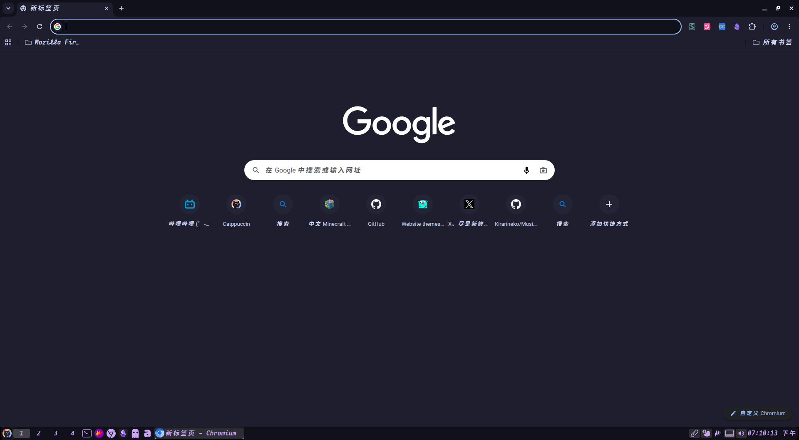
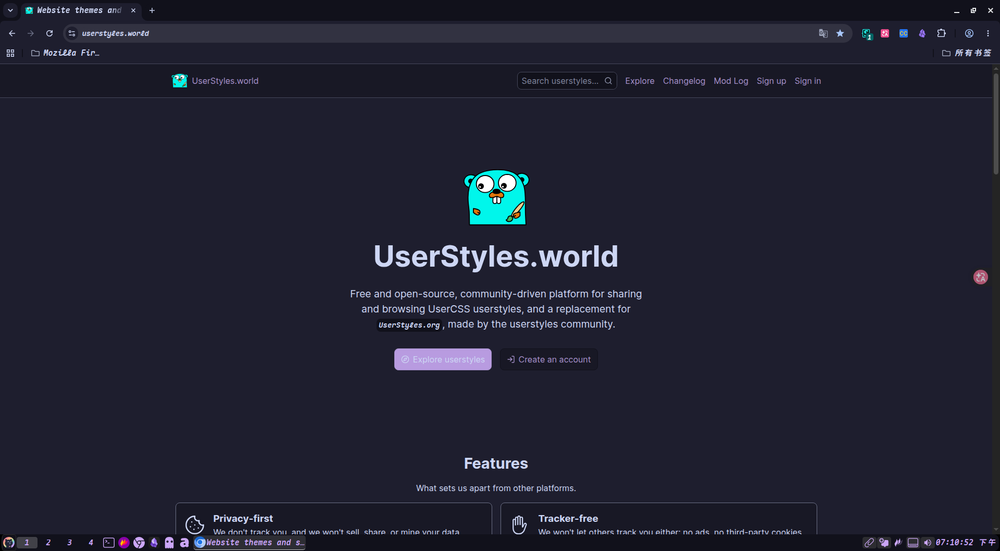

# 🎨 My Catppuccin Userstyles

## 中文说明

这是一个为 Stylus 扩展准备的 Catppuccin Mocha 配色主题配置文件。

### 📦 包含内容
- `userstylus.json` — 适用于 Stylus 的完整 Catppuccin Mocha 主题

### 🚀 如何使用
1. 安装浏览器扩展 [Stylus](https://add0n.com/stylus.html)（Chrome / Firefox / Edge 均可）
2. 打开 Stylus 管理面板，点击「导入」
3. 选择本仓库中的 `userstylus.json` 文件
4. 确认导入并启用即可

### 🎨 配色预览
| 角色 | 颜色 | 色值 |
|:---|:---|:---|
| 主文本 | 󰅉 | `#cdd6f4` |
| 背景 | 󰅉 | `#1e1e2e` |
| 粉色 | 󰅉 | `#f5c2e7` |
| 蓝色 | 󰅉 | `#89b4fa` |
| 红色 | 󰅉 | `#f38ba8` |
| 绿色 | 󰅉 | `#a6e3a1` |

### 📌 注意
本主题基于 Catppuccin 官方配色方案，适用于支持 Stylus 扩展的所有网站。你可以根据自己的喜好通过 Stylus 的颜色选择器微调。

---
## English

### 📦 Contents
- `userstylus.json` — Complete Catppuccin Mocha theme for Stylus

### 🚀 How to Use
1. Install the [Stylus](https://add0n.com/stylus.html) browser extension (Chrome / Firefox / Edge)
2. Open Stylus management panel and click "Import"
3. Select the `userstylus.json` file from this repository
4. Confirm import and enable the theme

### 🎨 Color Palette
| Role | Color | Value |
|:---|:---|:---|
| Text | 󰅉 | `#cdd6f4` |
| Background | 󰅉 | `#1e1e2e` |
| Pink | 󰅉 | `#f5c2e7` |
| Blue | 󰅉 | `#89b4fa` |
| Red | 󰅉 | `#f38ba8` |
| Green | 󰅉 | `#a6e3a1` |

### 📌 Note
This theme is based on the official Catppuccin color palette and works on any website that supports the Stylus extension. You can fine-tune the colors using Stylus' built-in color picker.

---

📖 **Catppuccin Official**: [https://github.com/catppuccin/catppuccin](https://github.com/catppuccin/catppuccin)

